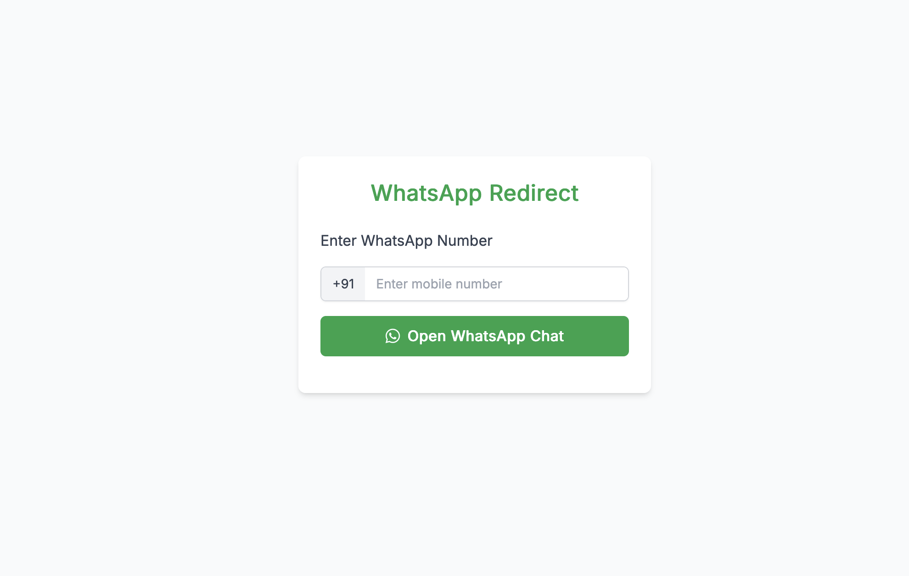

# 📱 WhatsApp Redirect

A lightweight web app to instantly open a WhatsApp chat with any phone number — perfect for quick communication without saving the number.



---

## 🚀 Features

- 📞 Input a mobile number with a default country code (`+91`)
- 🔗 Redirects to WhatsApp chat via `https://wa.me/`
- ⚡ Instant and mobile-friendly UI
- 🧼 No backend or database required

---

## 🌐 Demo

Try it live on GitHub Pages:  
👉 [sachinwakle.github.io/whatsapp-redirect](https://sachinwakle.github.io/whatsapp-redirect)

---

## 📦 How to Use

1. **Clone the repository**
   ```bash
   git clone https://github.com/sachinwakle/whatsapp-redirect.git
   cd whatsapp-redirect
